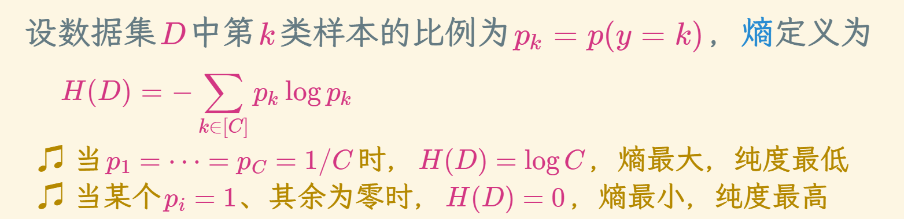
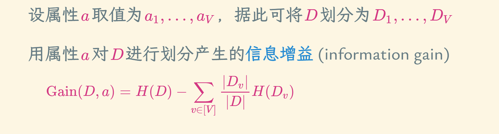
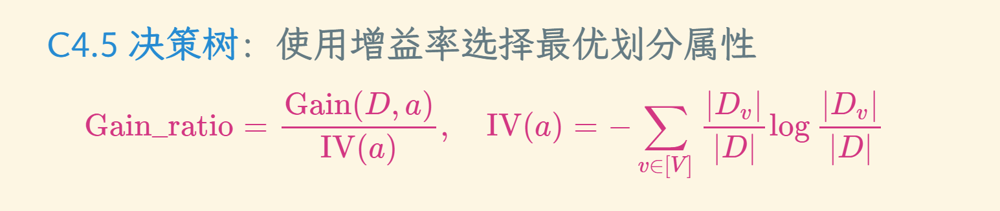
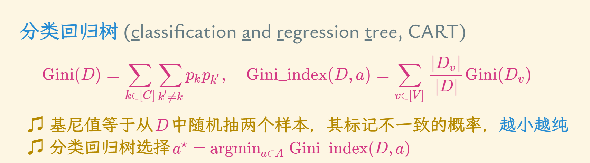

# 决策树
## 符号学派 规则学习
* 规则学习中的规则 (rule) 指狭义的逻辑规则，呈 if-then 形式
* 文字 (literal)：对特征进行检验的布尔表达式，如(天气 = 雨天)
* 规则头：也是文字，一般表示规则判定的标记、类别或概念
* 规则体：即前提，由逻辑文字组成的合取式，文字个数称为规则长度
* 符合规则的样本称为被该规则覆盖

### 冲突
* 一个样本若被判定结果不同的多个规则覆盖，称发生了冲突
* 冲突消解：（投票法：少数服从多数）、（排序法：在规则集合上定义一个优先级顺序）、（元规则法：规则的规则，例如“发生冲突时使用长度最小的规则”）

### 序贯覆盖
* 从空规则开始，将正类作为规则头，遍历每个特征的取值
* 若当前规则的规则体仅覆盖正类样本，则由此产生一条规则
* 去掉所有已被覆盖的样本
* 在剩下的训练数据集上重复上述过程

### 决策树
* 划分样本
* 生成结点node 
* if D中样本全属于同一类别C then // 递归情形 1   将node标记为C类叶结点 return 
* if A=∅ or D中样本在A上取值相同 then // 递归情形 2   将node标记为叶结点，其类别标记为D中样本最多的类 return 
* 从A中选择最优划分属性a⋆，对a⋆的每一个取值a⋆v，为node生成一个分支，
* 令Dv表示D在a⋆上取值为a⋆v的样本子集 if Dv=∅ then // 递归情形 3   将分支结点标记为叶结点，其类别标记为D中样本最多的类 return
*  else   以TreeGenerate(Dv,A∖{a⋆})为分支结点

### 信息增熵
* 随着划分的不断进行，决策树结点的纯度越来越高
* 划分一次属性就会带来熵值的改变

* 所以选取决策指标的时候，可以依据熵增益最大的来

### 增益率 基尼指数
* 使用增益率选择最优划分属性
  
* 分类决策树：基尼值等于从D中随机抽两个样本，其标记不一致的概率，越小越纯 、

