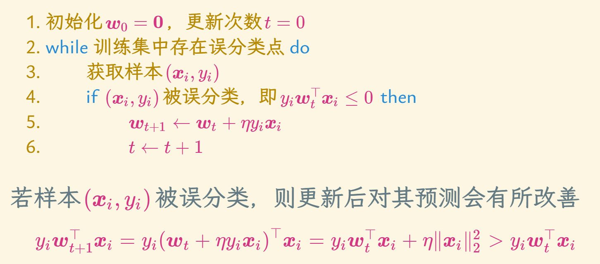
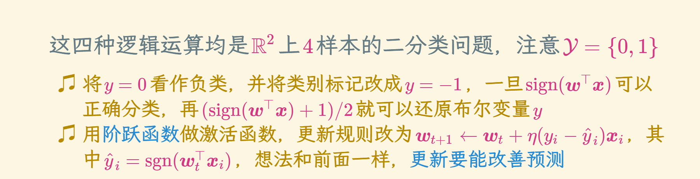
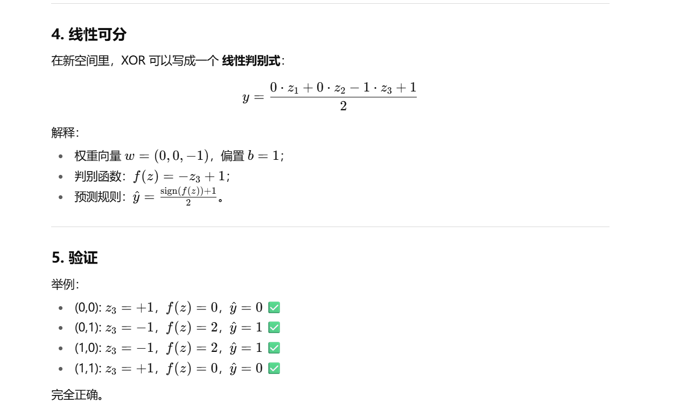

# 感知机

## M-P神经元模型
* 接收来自d个其它神经元传来的输入信号
* 加权输入总和与偏置b相加
* 通过激活函数输出，激活函数有很多种

## 感知机
* 用超平面将空间一分为二，位于超平面两侧的样本分别被预测为正类和负类
* 感知机属于线性分类器 (linear classifier) 的范畴
* 若样本(xi,yi)被误分类，则更新后对其预测会有所改善
* 学习率必须大于0

* 与或非都是线性二分问题，可以用感知机来做
  

### 更好的界
* 感知机最终得到的超平面不唯一
* 与w的初始化有关
* 与迭代过程中误分类点的顺序也有关
* 间隔也没有保证，可能会很小，而间隔与泛化性能是息息相关的

### 非线性可分数据 --采用特征变换
* 核映射：核感知机 (kernel perceptron)：对于异或问题，我们在二维空间那四个点事没办法线性可分的，这里采用核函数对其进行升维度，同时加上一个特征，就可以找到一个平面将他们分开。

* 函数复合：多层感知机 (multi-layer perceptron, MLP)，