# 神经网络
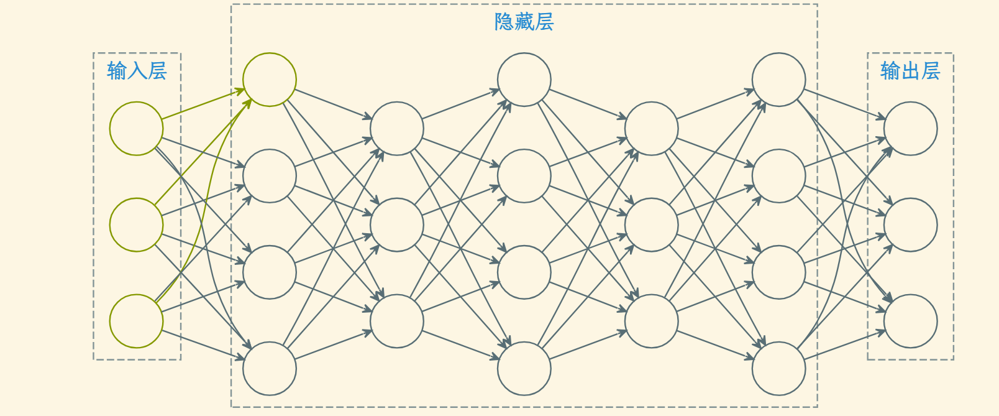
* 黄色部分就是个 M-P 神经元模型
* 大量的神经元并行串联就构成了神经网络
* 只要存在隐藏层，神经网络就拥有了非线性分类能力
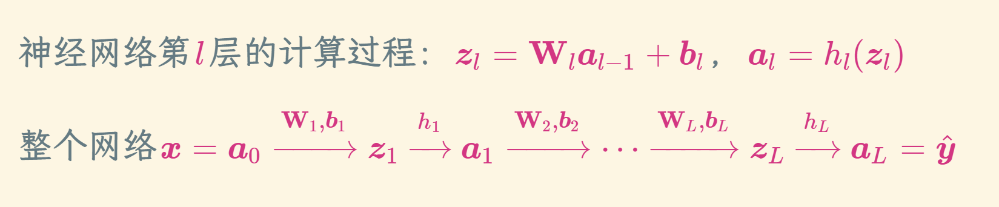

## 激活函数
* 连续并几乎处处可导，可以高效计算
* 导数的值域在合适的范围内，否则影响用梯度下降进行训练
### sigmoid型
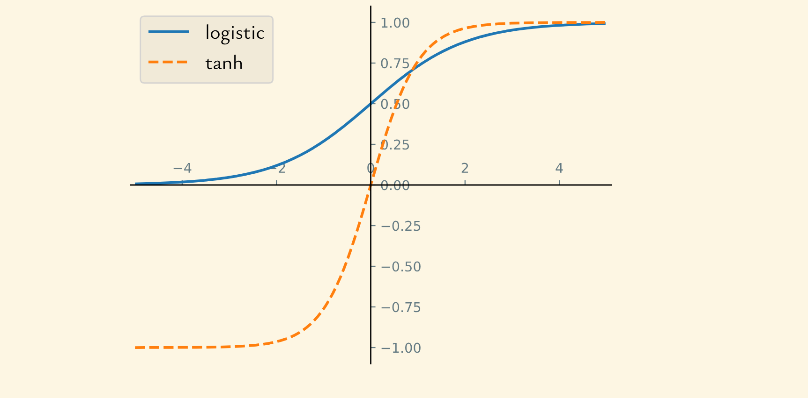
### 对率函数
  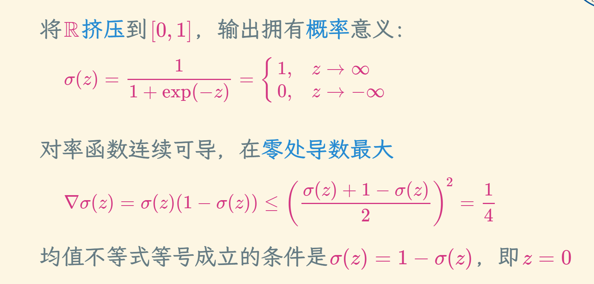
### 双曲正切函数
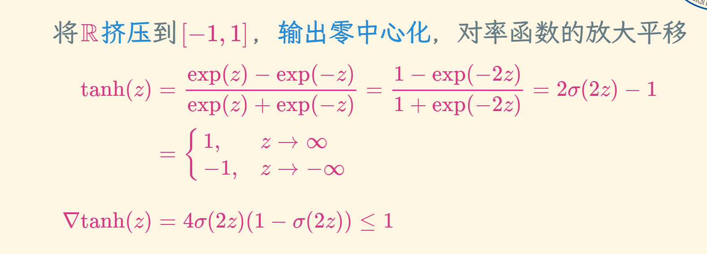
* 输出零中心化使得非输入层的输入都在零附近，而双曲正切函数在零处导数最大，梯度下降更新效率较高，对率函数输出恒为正，会减慢梯度下降的收敛速度
* 这里就有一个思想，我们要合理控制梯度下降的速率，不能太快也不能太慢
### 整流线性单元
 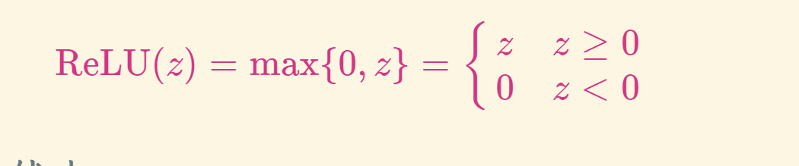
#### 优点
* 计算只涉及加法、乘法和比较操作，非常高效
* 生物学解释：单侧抑制，宽兴奋边界，稀疏兴奋
* 在z>0时导数恒为1，缓解了梯度消失问题
#### 缺点
* 输出非零中心化，对下一层不友好
* 死亡 ReLU 问题：对异常值特别敏感

### RELU
#### 死亡RELU问题
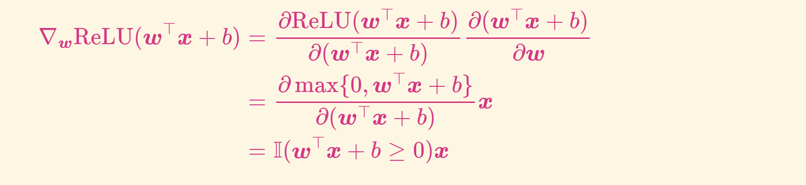
* 如果第一个隐藏层中的某个神经元对应的(w,b)初始化不当，使得对任意x有w⊤x+b<0，那么其关于(w,b)的梯度将为零，在以后的训练过程中永远不会被更新
####  带泄漏的 ReLU
* 当w⊤x+b<0时也有非零梯度
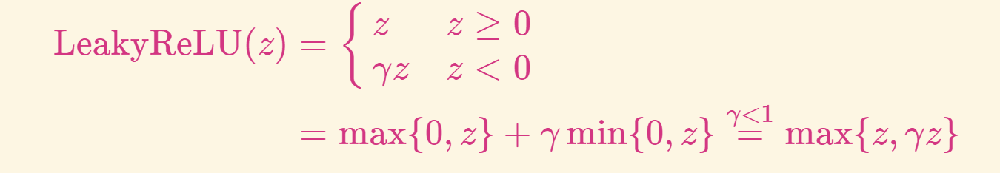
* 其中斜率γ是一个很小的常数

#### 带参数的 ReLU：斜率γi可学习

### Swish 函数
* Swish 函数是一种自门控 (self-gated) 激活函数：
  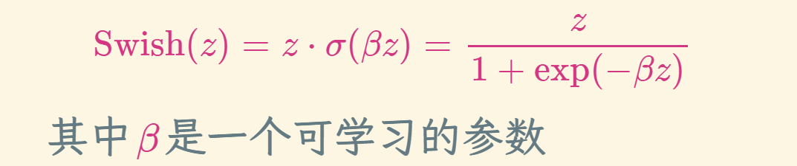
* 当σ(βz)接近于1时，门处于开状态，激活函数的输出近似于z本身
* 当σ(βz)接近于0时，门处于关状态，激活函数的输出近似于0

## 神经网络的表示能力
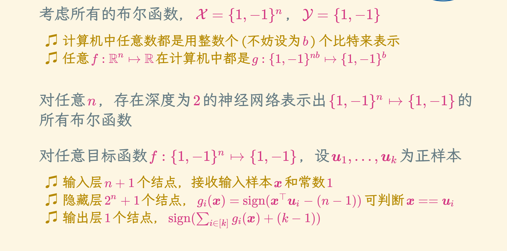
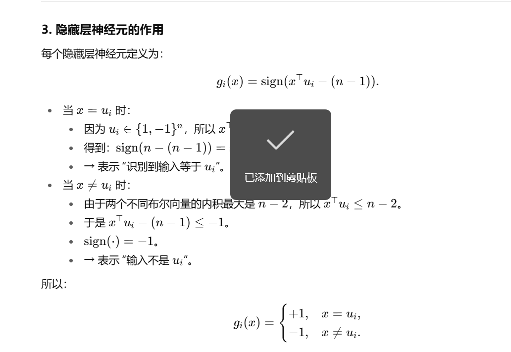
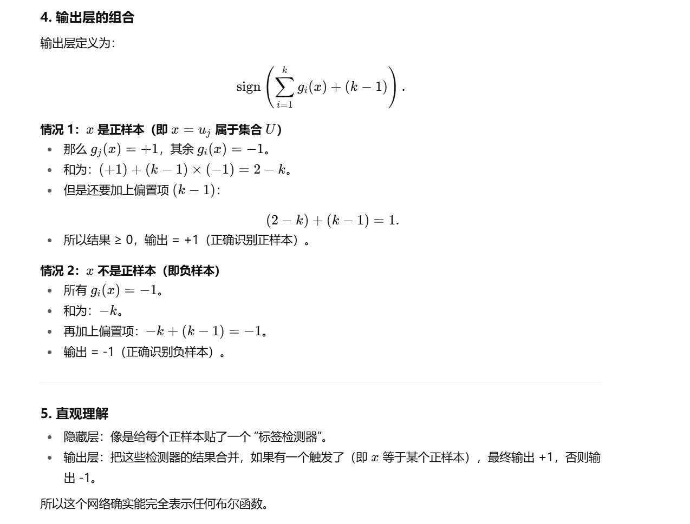

* 半空间：简单来说就是被超平面分割开来的空间
* 神经网络可以用逻辑“交 / 并”的方式组合半空间，从而表示复杂的几何区域 → 进而表示任意布尔函数。
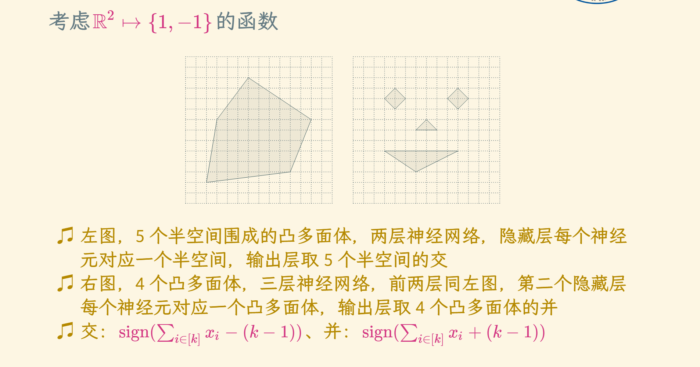

### VC维：一个模型能够完美拟合（即任意标记）的最大样本点数量
* 给你一组数据点，你可以给它们任意贴上标签（比如 +1 或 -1）。
* 如果某个模型类（如线性分类器、神经网络等）总能找到一个模型，使得对这组点的所有可能标签组合都能正确分类，那么就说这个模型类可以“打碎”（shatter）这些点。
* VC维就是这个模型类最多能打碎的点的数量
* 二维线性分类器的 VC 维 = 3，任意3个不共线的点，无论怎么标 +1/-1，总能用一条直线分开（或找到一条直线实现该划分

* 深度学习：特征工程和模型学习合二为一，端到端 (end-to-end)

## 求解参数
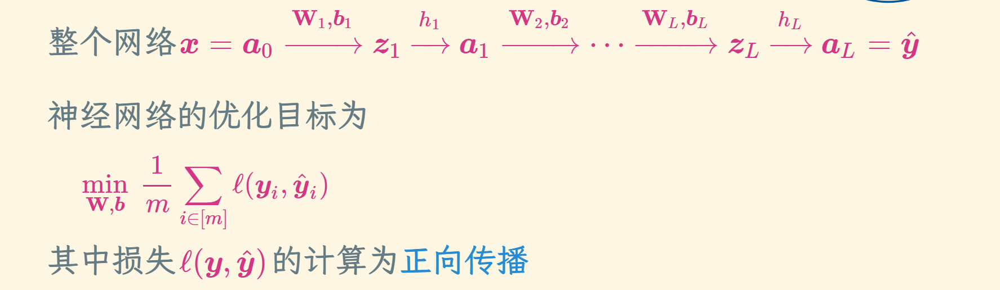
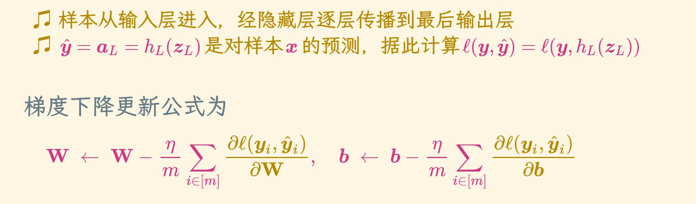

## 反向传播
* 反向传播 (backpropagation, BP)：前一层误差由后一层得到

## 神经网络的训练
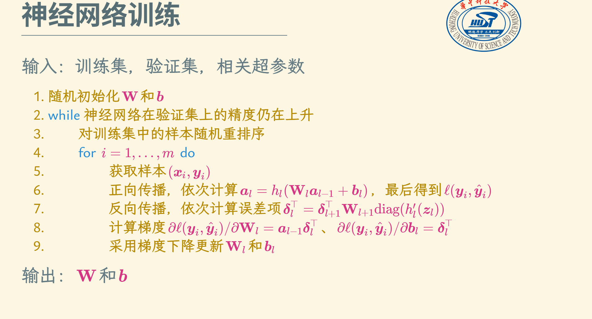

## 卷积神经网络
