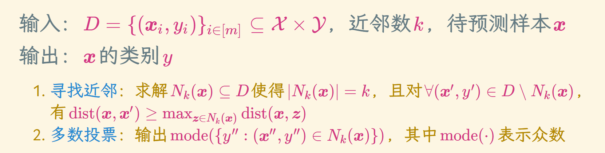
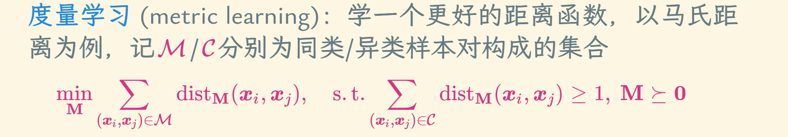

# K临近算法
* 基本假设：相似的样本属于相同的类别
* 如何刻画相似？距离函数

## 超参设置

* 奇数可保证取众数时不会出现打平的情况
* 越小越容易过拟合，越大越容易欠拟合，实践中多通过交叉验证选取

## 优劣
### 优点
* 简单，全方位的
* 无训练过程，只需存下数据，惰性学习 (lazy learning)
* 样本极少时也能用
* 特征空间维度不高时效果很好
* 一致性：若贝叶斯最优分类器的错误率R⋆=0，k-近邻也能渐进达到
### 缺点
* 预测很慢，要计算待预测样本与训练集中所有样本的距离
* 维度灾难：高维空间中的距离会失效，k-近邻效果很差

## 渐进分析
* 条件：输入空间是可分度量空间